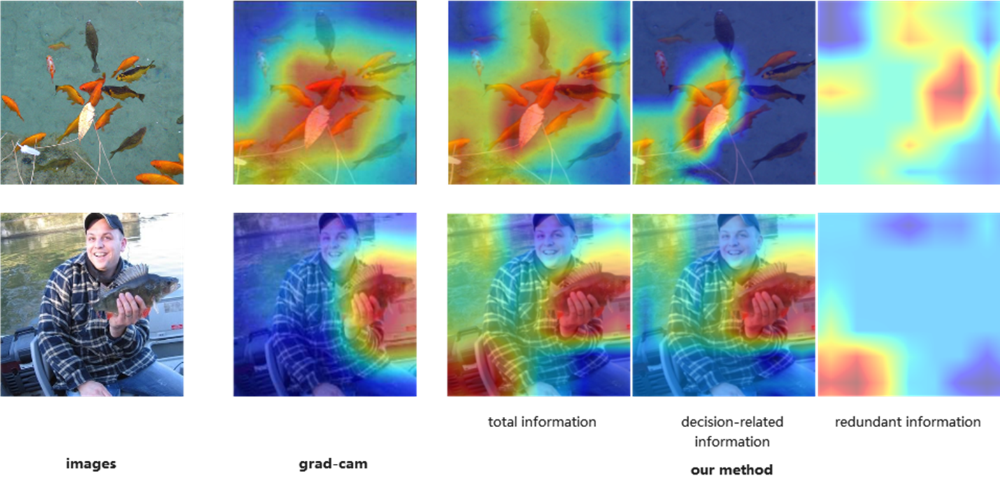

# mire

**Mutual Information-based Representation Explainer**

`mire` 是一个基于互信息的神经网络表征解释框架，旨在分解输入与表征之间的关系为总互信息、决策相关信息和冗余信息。该项目实现了论文《Explaining Representation by Mutual Information》中提出的方法，并通过热图可视化表征内容。支持在 ResNet 等架构上运行，适用于图像分类等任务的解释。


## 功能

- 使用互信息理论分解神经网络表征。
- 通过轻量级模块（Infomax 估计器和掩码模块）估计信息成分。
- 生成表征的总信息、决策相关信息和冗余信息的热图可视化。
- 无需修改原始网络参数，仅需微调附加模块。




## 使用方法

### 1. 数据准备
下载 [ImageNet-Mini 数据集](https://www.kaggle.com/datasets/ifigotin/imagenetmini-1000) 并解压至 `d:/data/imagenet-mini/train`（或修改代码中的路径）。

### 2. 训练模型
运行 `train.py` 以训练模型并生成 `model_imagenet.pth`：
```bash
python train.py
```

### 3. 解释表征
运行主文件 `main.py`，加载 `model_imagenet.pth` 并生成解释热图：
```bash
python main.py
```
输出将包括原始图像与总互信息、决策相关信息及冗余信息的叠加热图。

## 文件结构

```
mire/
├── train.py         # 训练脚本，生成 model_imagenet.pth
├── main.py          # 主脚本，加载模型并可视化表征
├── model_imagenet.pth  # 训练后的模型参数（运行后生成）
└── README.md        # 项目说明文件
```

## 注意事项

- 确保 `imagenet_path` 与数据集路径匹配，默认设置为 `d:/data/imagenet-mini/train`。
- 训练默认使用 GPU（如可用），否则自动切换至 CPU。
- 当前代码支持 ResNet50，可通过修改 `main.py` 中的 `local_conv_layers` 和 `global_pool_layer` 适配其他层或模型。

